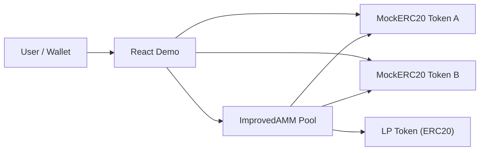

# Architecture

## Overview

The system contains two ERC-20 demo assets, one AMM pool, and a React frontend.



## Contract Responsibilities

- `MockERC20` provides mintable local tokens for repeatable demos and tests.
- `ImprovedAMM` holds reserves, calculates quotes, executes swaps, and mints/burns LP shares.
- The LP token is implemented by making `ImprovedAMM` inherit `ERC20`.

## AMM Math

The base model follows constant-product pricing:

```text
x * y = k
```

For quoting, the project uses priced reserves:

```text
pricedReserveIn = actualReserveIn + virtualReserveIn
pricedReserveOut = actualReserveOut + virtualReserveOut
```

The output is computed after fees, then adjusted so virtual liquidity affects price without becoming withdrawable liquidity.

## Demo Flow

1. Deploy two mock tokens and the AMM.
2. Mint tokens to the demo wallet.
3. Approve the AMM to transfer tokens.
4. Add liquidity to initialize reserves.
5. Quote a Token A to Token B swap.
6. Execute the swap with `minAmountOut` and `deadline`.
