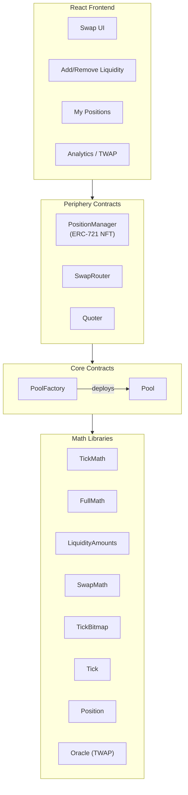

# Architecture — Concentrated Liquidity AMM

## System Overview

This project implements **Option 5: AMM with Novel Features** using a Uniswap V3-style concentrated liquidity model. Liquidity providers choose a price range `[tickLower, tickUpper]`; only liquidity within the current price range is active and earns fees.



---

## Contract Responsibilities

### Core

| Contract | Role |
|----------|------|
| `PoolFactory` | Deploys pools for (token0, token1, fee) triplets. Maintains registry. Supports fee tiers 500 / 3000 / 10000. |
| `Pool` | The concentrated liquidity engine. Holds reserves, tracks ticks and positions, emits oracle observations. Exposes `mint`, `burn`, `swap`, `collect`. |

### Periphery

| Contract | Role |
|----------|------|
| `PositionManager` | ERC-721 NFT wrapper. Each token ID = one LP position. Handles `mint`, `increaseLiquidity`, `decreaseLiquidity`, `collect`. |
| `SwapRouter` | Stateless router for `exactInputSingle`, `exactOutputSingle`, and multi-hop `exactInput`. |
| `Quoter` | Simulates swaps (reverts with result) to get price quotes without spending gas. |

### Math Libraries

| Library | Purpose |
|---------|---------|
| `FullMath` | 512-bit `mulDiv` — prevents overflow in fee and liquidity calculations |
| `TickMath` | Converts between `int24 tick` and `uint160 sqrtPriceX96` (Q64.96 format) |
| `SqrtPriceMath` | Token amounts from sqrt price changes |
| `LiquidityAmounts` | Max liquidity from desired token amounts and price range |
| `SwapMath` | Single swap step: price → (amountIn, amountOut, fee) |
| `TickBitmap` | Packed uint256 bitmap for efficient next-initialized-tick search |
| `Tick` | Per-tick fee tracking and liquidity net; `cross()` on tick traversal |
| `Position` | Per-position fee accumulation using `feeGrowthInside` snapshots |
| `Oracle` | Ring buffer of (timestamp, tickCumulative) observations for TWAP |
| `LiquidityMath` | Safe add/subtract for uint128 liquidity |
| `SafeCast` | Checked down-casts (uint256→uint160, int256→int128, etc.) |

---

## Core Mathematics

### Price Representation

Price is stored as `sqrtPriceX96` — the square root of the token1/token0 price ratio, in Q64.96 fixed-point:

```
sqrtPriceX96 = sqrt(price) × 2^96
```

Ticks use logarithmic spacing: each tick represents a 0.01% price move:

```
price(tick) = 1.0001^tick
sqrtPrice(tick) = 1.0001^(tick/2)
```

### Concentrated Liquidity Invariant

Within a position's range `[sqrtPriceA, sqrtPriceB]`:

```
L = amount0 / (1/sqrtPrice - 1/sqrtPriceUpper)
L = amount1 / (sqrtPrice - sqrtPriceLower)
```

When the pool's current price is inside the range:
```
amount0 = L × (1/sqrtPrice - 1/sqrtPriceUpper)
amount1 = L × (sqrtPrice - sqrtPriceLower)
```

### Fee Accumulation

Fees are tracked using global fee growth variables (per unit of liquidity), snapshotted per position:

```
feeOwed = liquidity × (feeGrowthGlobalNow - feeGrowthInside0Last) / 2^128
```

Ticks store `feeGrowthOutside` which is flipped when the price crosses them, enabling O(1) fee computation for any range.

### Swap Loop (Tick Crossing)

Each swap iterates through ticks:

```
while amountRemaining != 0 and price != limit:
  1. Find next initialized tick in bitmap
  2. Compute swap step up to that tick (SwapMath.computeSwapStep)
  3. Accumulate fee growth
  4. If tick crossed: flip feeGrowthOutside, update active liquidity
  5. Update state
```

### TWAP Oracle

The pool stores an array of 65535 observations `{timestamp, tickCumulative}`. TWAP over period Δt:

```
arithmeticMeanTick = (tickCumulative[now] - tickCumulative[now - Δt]) / Δt
price_twap ≈ 1.0001^arithmeticMeanTick
```

---

## Fee Tiers

| Fee | Tick Spacing | Best For |
|-----|-------------|---------|
| 0.05% (500) | 10 | Stablecoins, highly correlated pairs |
| 0.30% (3000) | 60 | Standard volatile pairs |
| 1.00% (10000) | 200 | Exotic / very volatile pairs |

---

## Novel Features vs. Standard AMMs

| Feature | Uniswap V2 | This AMM |
|---------|-----------|---------|
| Liquidity distribution | Full range (0→∞) | Concentrated range `[tickLower, tickUpper]` |
| Capital efficiency | Low (most liquidity idle) | High (LPs choose active range) |
| LP token | ERC-20 (fungible) | ERC-721 NFT (unique per range) |
| Price oracle | Block-delayed spot | Geometric mean TWAP (manipulation resistant) |
| Fee structure | Fixed | Three tiers (500/3000/10000 pips) |
| Slippage | Higher (wide spread) | Lower (concentrated depth around current price) |

---

## Security Design

1. **Reentrancy guard** — `slot0.unlocked` flag prevents re-entrant calls into `mint`/`burn`/`swap`/`collect`
2. **Callback verification** — mint and swap callbacks verify `msg.sender == expectedPool` from factory registry
3. **Integer safety** — all math uses `FullMath.mulDiv` or Solidity 0.8.x checked arithmetic; `unchecked` only where overflow is intended (e.g., fee growth ring arithmetic)
4. **Slippage protection** — all user-facing functions accept `amountMin`/`amountMax` and `deadline`
5. **Price limit** — `sqrtPriceLimitX96` on swaps prevents the router from executing past a user-specified price

---

## Component Interaction Sequence

**Add Liquidity:**
```
User → PositionManager.mint()
  → Pool.mint()  [computes amounts needed]
    → IPoolMintCallback(PositionManager).uniswapV3MintCallback()
      → IERC20.transferFrom(user → pool)
  ← Pool returns (amount0, amount1)
← PositionManager mints NFT, returns tokenId
```

**Swap:**
```
User → SwapRouter.exactInputSingle()
  → Pool.swap()  [executes tick loop, sends output to recipient]
    → IPoolSwapCallback(SwapRouter).uniswapV3SwapCallback()
      → IERC20.transferFrom(user → pool)
```
